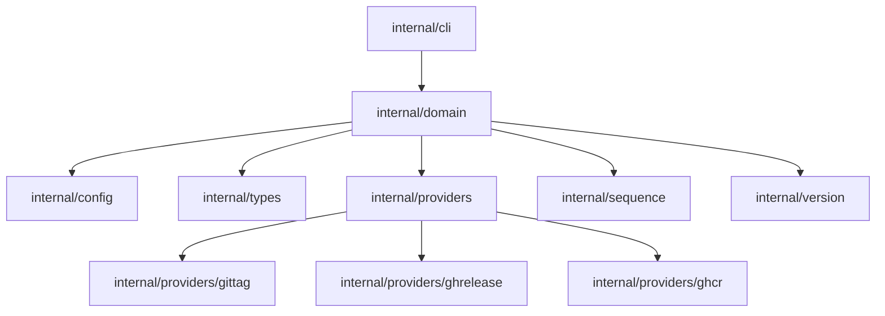
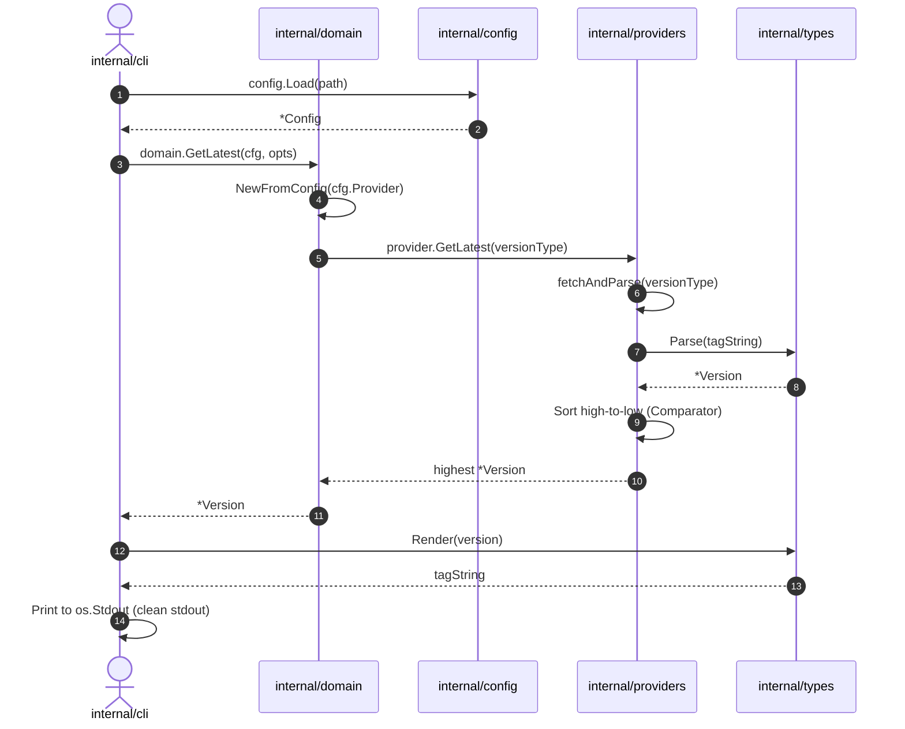
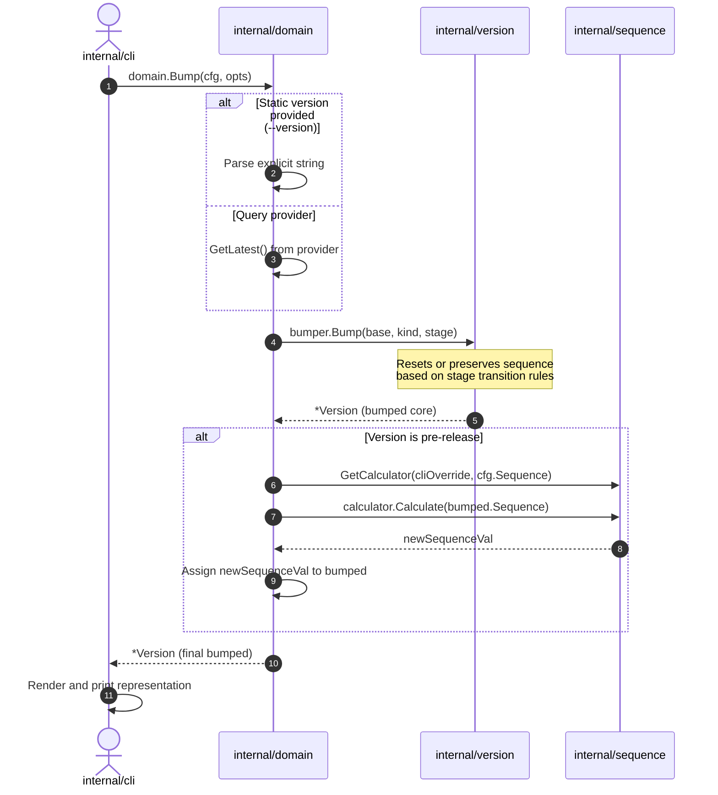

# Verge Architecture Guide

Verge is a deterministic, fast version generation CLI written in Go. It is architected under the principles of **Domain-Driven Design (DDD)** and **Clean Architecture**, completely decoupling user-interface parsing, configuration parsing, external integrations, and the core domain calculation models.

---

## 1. System Package Architecture

The physical package structure is designed to isolate concerns cleanly. High-level orchestrators (CLI) depend on intermediate domain packages, which in turn use abstract interfaces to interact with external providers or formats:



### Detailed Package Breakdown

| Package Path | Core Responsibility |
| :--- | :--- |
| `cmd/verge/` | Primary entry point. Responsible for injecting build information (ldflags) and executing the root command. |
| `internal/cli/` | User Interface (CLI flags, stdout/stderr formatting, error code handling). Leverages the `spf13/cobra` command framework. |
| `internal/config/` | Config parsing (`.verge.yaml`), default overrides, and environment variable lookups. |
| `internal/domain/` | Orchestration layer. Houses the factories and service operations (e.g. `domain.Bump`, `domain.GetLatest`) that tie all subcomponents together. |
| `internal/types/` | Formatting and syntax modules. Dictates how `semver`, `vsemver`, and `pep440` versions are parsed from and rendered back to strings. |
| `internal/providers/` | History retrieval abstractions. Integrates against local git systems or remote HTTP APIs to gather historical tags. |
| `internal/sequence/` | Calculations of suffix pre-release tokens (`increment`, `filehash`, `passed`). |
| `internal/version/` | Core domain structs and pure bumping mathematical algorithms (totally decoupled from CLI or filesystem). |

---

## 2. Core Interfaces

Extensibility is achieved by programming to interfaces. Adding support for new formats or cloud providers requires implementing these exact contracts:

### A. Version Format: `types.VersionType`
Decouples version syntax parsing and rendering from the CLI:
```go
type VersionType interface {
	Name() string
	Parse(input string) (*version.Version, error)
	Render(v *version.Version) string
}
```

### B. History Source: `providers.VersionProvider`
Abstracts local disk operations or remote web APIs:
```go
type VersionProvider interface {
	Name() string
	GetLatest(versionType string) (*version.Version, error)
	GetLatestSpecific(versionType string, prefix string) (*version.Version, error)
}
```

### C. Sequence Generator: `sequence.Calculator`
Determines how suffix prerelease tags are computed:
```go
type Calculator interface {
	Calculate(current interface{}) (interface{}, error)
}
```

### E. Version Comparison & Bumping: `version.Comparator` & `version.Bumper`
Encapsulates version comparison and modification logic:
```go
type Comparator interface {
	Compare(a, b *Version) int
}

type Bumper interface {
	Bump(v *Version, kind BumpKind, stage Stage) (*Version, error)
}
```

---

## 3. Core Execution Flows

### Flow A: Querying Latest Version (`verge latest`)

This flow depicts how Verge queries a provider, parses the results, and displays the highest version matching active rules:



---

### Flow B: Bumping Version and Resolving Sequence (`verge bump`)

This flow details how Verge cascades options, determines the base version, performs the semantic component bump, and dynamically computes pre-release sequence hashes or numbers:



---

## 4. Architectural Safeguards

1. **Side-Effect Free Execution:** The system provides strict read-only calculations. Under no circumstances should any code in `internal/` perform write commands to remote git providers, container registries, or modify source code files.
2. **Stdout Hygiene:** To facilitate direct shell parameter execution `VAR=$(verge bump)`, no diagnostic logging, informational tracing, or errors should be printed to standard output (`os.Stdout`). All tracing, warnings, and error messages must go to `os.Stderr`.
3. **Decoupled Formatting:** The `internal/version` package works strictly with integers and stage indicators. It contains no code formatting information (e.g., prefixing `v` or removing dots). String formatting details are confined to `internal/types`.
