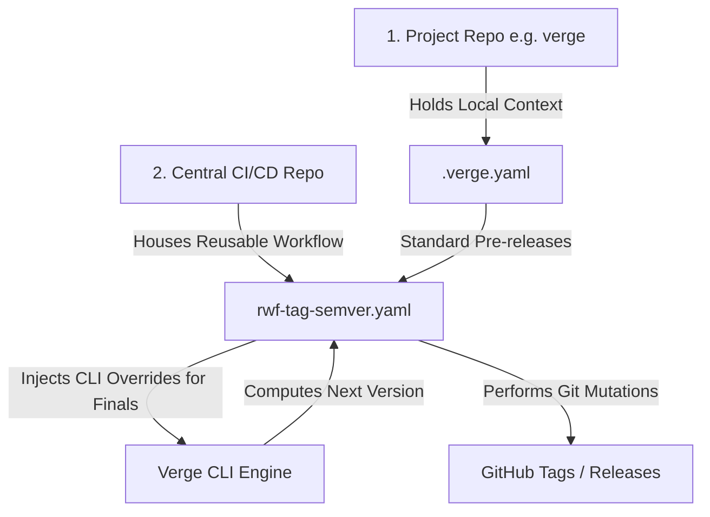

# Centralized CI/CD Reusable Workflows Integration Guide

This guide provides a comprehensive architectural blueprint for implementing a centralized, robust, and generic version release pipeline using **Verge** inside your central **CI/CD reusable workflows repository**.

---

## 1. Architectural Philosophy

To build an extensible CI/CD ecosystem, we enforce a strict separation of concerns between the **Calculator** and the **Orchestrator**:



1. **The Calculator (Project Repo):** Each developer project contains a local `.verge.yaml` file that defines its version formats (`vsemver`, `semver`), active tracking providers (`gittag`, `ghcr`), and dynamic sequence parameters (`filehash`, `increment`).
2. **The Orchestrator (Central CI/CD Repo):** The central repository houses **generic Reusable Workflows (RWF)**. It is responsible for installing Verge, executing tag mutations, handling error cleanups, and coordinating package build/release tasks (e.g. GoReleaser, Docker). It accepts parameters to override project-level defaults during major production releases.

---

## 2. Installing Verge in Reusable Workflows

Your centralized workflow should dynamically download and install Verge during execution to ensure the pipeline is always running the latest version. The quick, cross-platform install script is perfectly suited for this:

```yaml
      - name: Install Verge CLI
        run: |
          curl -sSL https://raw.githubusercontent.com/armckinney/verge/main/install.sh | bash
          # Verge is now globally available in the runner's PATH (e.g., ~/.local/bin/verge)
```

---

## 3. The Centralized Reusable Workflow Spec

Create the following file in your central CI/CD repository at `.github/workflows/rwf-tag-semver.yaml`. 

This workflow is **fully generic**: it relies on the project's local `.verge.yaml` by default, but accepts inputs to override parameters for specific release lines (such as promoting pre-releases to final production tags).

```yaml
# Location: CENTRAL_CICD_REPO/.github/workflows/rwf-tag-semver.yaml
name: Verge Release Orchestrator

on:
  workflow_call:
    inputs:
      bump_kind:
        description: 'Semantic bump override (major | minor | patch | prerelease | final)'
        type: string
        required: false
      prerelease_stage:
        description: 'Prerelease stage override (dev | a | b | rc)'
        type: string
        required: false
      sequence_override:
        description: 'Inject static sequence suffix to bypass calculators'
        type: string
        required: false
      version_type_override:
        description: 'Override global format parsed (semver | vsemver | pep440)'
        type: string
        required: false
      provider_override:
        description: 'Override active tracking provider (gittag | ghrelease | ghcr)'
        type: string
        required: false
      prune_dev_tags:
        description: 'Whether to prune old dev tags upon successful final release promotion'
        type: boolean
        required: false
        default: true
    secrets:
      RELEASE_TOKEN:
        description: 'GitHub token with contents write permissions'
        required: true

jobs:
  orchestrate:
    runs-on: ubuntu-latest
    steps:
      - name: Checkout Project Source
        uses: actions/checkout@v4
        with:
          fetch-depth: 0 # Required to parse full git tag histories

      - name: Set up Go
        uses: actions/setup-go@v5
        with:
          go-version: '1.21' # Or go-version-file: go.mod

      - name: Install Verge CLI
        run: |
          curl -sSL https://raw.githubusercontent.com/armckinney/verge/main/install.sh | bash
          verge --help

      - name: Calculate next version
        id: verge_calc
        run: |
          # Dynamically build command args based on workflow inputs
          ARGS=""
          if [[ -n "${{ inputs.bump_kind }}" ]]; then ARGS="$ARGS --kind ${{ inputs.bump_kind }}"; fi
          if [[ -n "${{ inputs.prerelease_stage }}" ]]; then ARGS="$ARGS --stage ${{ inputs.prerelease_stage }}"; fi
          if [[ -n "${{ inputs.sequence_override }}" ]]; then ARGS="$ARGS --sequence ${{ inputs.sequence_override }}"; fi
          if [[ -n "${{ inputs.version_type_override }}" ]]; then ARGS="$ARGS --type ${{ inputs.version_type_override }}"; fi
          if [[ -n "${{ inputs.provider_override }}" ]]; then ARGS="$ARGS --provider ${{ inputs.provider_override }}"; fi
          
          # Calculate tag using Verge CLI
          TAG=$(verge bump $ARGS)
          echo "Calculated Tag: $TAG"
          echo "tag=$TAG" >> $GITHUB_OUTPUT

      # --- GIT TAG MUTATION ---
      - name: Create and Push Git Tag
        id: git_mutation
        run: |
          git config --global user.name "github-actions[bot]"
          git config --global user.email "github-actions[bot]@users.noreply.github.com"
          
          git tag "${{ steps.verge_calc.outputs.tag }}"
          git push origin "${{ steps.verge_calc.outputs.tag }}"
          echo "mutated=true" >> $GITHUB_OUTPUT

      # --- PROJECT PACKAGE PUBLISHING STEP ---
      - name: Build & Publish Release Packages
        # (This is where you invoke goreleaser, build docker, or publish python packages)
        run: |
          echo "Building and releasing packages for version ${{ steps.verge_calc.outputs.tag }}..."
          # E.g. goreleaser release --clean
        env:
          GITHUB_TOKEN: ${{ secrets.RELEASE_TOKEN }}

      # --- FAIL-SAFE CLEANUP STEP ---
      - name: Clean up Tag on Failure
        if: failure() && steps.git_mutation.outputs.mutated == 'true'
        run: |
          echo "Pipeline execution failed. Reverting pushed tag to prevent git state corruption..."
          git push --delete origin "${{ steps.verge_calc.outputs.tag }}"
          git tag -d "${{ steps.verge_calc.outputs.tag }}"

      # --- HOUSEKEEPING / DEV TAG PRUNING ---
      - name: Prune Old Dev Tags on Final Release
        if: success() && inputs.prune_dev_tags == true && inputs.bump_kind == 'final'
        run: |
          # If we successfully promoted to a final release (e.g., v1.2.3),
          # prune all old intermediate development tags (e.g., v1.2.3-dev.*)
          TAG="${{ steps.verge_calc.outputs.tag }}"
          echo "Production release successful. Pruning dev tags for version line ${TAG}..."
          
          # Safely fetch and delete remote/local dev tags matching version
          git tag -l "${TAG}-dev.*" | xargs -I {} sh -c 'git tag -d {}; git push --delete origin {};' || true
```

---

## 4. How Consumer Projects Integrate the RWF

Once your centralized reusable workflow is published in your CI/CD repository, individual developer projects (consumers) can integrate it with absolute ease.

### Step A: Project Config (`.verge.yaml`)
Developers configure their local versioning details inside their project repository. This serves as the default behavior for all pipeline pre-releases:

```yaml
# Location: DEVELOPER_PROJECT_REPO/.verge.yaml
version_type: vsemver

default:
  bump_kind: prerelease      # Default to dev pre-releases for branches
  prerelease_stage: dev

sequence:
  type: increment

provider:
  type: gittag
  gittag:
    repo_dir: "."
    include_prerelease: true
```

### Step B: The Project CI Pipeline (`.github/workflows/ci.yml`)
The developer project creates a simple CI pipeline. It calls the **same** reusable workflow for both branch builds (using defaults) and production releases (injecting final overrides):

```yaml
# Location: DEVELOPER_PROJECT_REPO/.github/workflows/ci.yml
name: Integration & Delivery

on:
  push:
    branches:
      - '**' # Triggers on all branches

jobs:
  # 1. Pipeline for PR Branches / Feature Branches
  prerelease:
    if: github.ref != 'refs/heads/main'
    uses: my-org/cicd-repo/.github/workflows/rwf-tag-semver.yaml@main
    with:
      # No overrides: Verge runs with local .verge.yaml defaults (vX.Y.Z-dev.N)
      prune_dev_tags: false
    secrets:
      RELEASE_TOKEN: ${{ secrets.GITHUB_TOKEN }}

  # 2. Pipeline for Production Releases (Merge to main)
  release:
    if: github.ref == 'refs/heads/main'
    uses: my-org/cicd-repo/.github/workflows/rwf-tag-semver.yaml@main
    with:
      # Override local config defaults to promote to a final production tag (vX.Y.Z)
      bump_kind: final
      prune_dev_tags: true # Prunes all dev tags of this version line
    secrets:
      RELEASE_TOKEN: ${{ secrets.GITHUB_TOKEN }}
```
