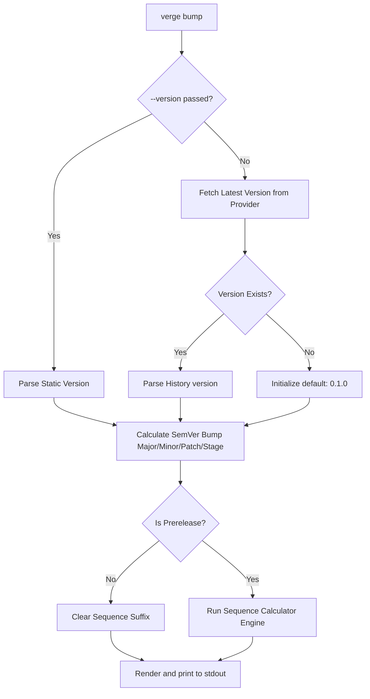

# `verge bump`

The `bump` command calculates and outputs the next logical version based on structural bumping rules, active stage guidelines, and dynamic sequence resolution. 

This command is strictly **read-only** and **side-effect free**: it calculates and returns the computed version string to `stdout`, but **does not** push git tags, edit files, or commit changes.

---

## Usage

```bash
verge bump [flags]
```

### Command-Specific Flags

* **`-t, --type string`**: Override configuration `version_type` (`semver` | `vsemver` | `pep440`).
* **`-p, --provider string`**: Override active tracking provider (`gittag` | `ghrelease` | `ghcr`).
* **`-v, --version string`**: **Bypass fetching entirely.** Evaluates and bumps the exact version string provided as an argument (e.g. `verge bump --version 1.2.3`).
* **`--prefix string`**: Prefix filter applied when fetching the latest version from the provider.
* **`--kind string`**: The type of semantic bump to execute:
  * `major`: Increments major, resets minor and patch to `0`, clears pre-release (`1.2.3` $\rightarrow$ `2.0.0`).
  * `minor`: Increments minor, resets patch to `0`, clears pre-release (`1.2.3` $\rightarrow$ `1.3.0`).
  * `patch`: Increments patch, clears pre-release (`1.2.3` $\rightarrow$ `1.2.4`).
  * `prerelease` (Default): Bumps patch and initiates/progresses pre-release tags (`1.2.3` $\rightarrow$ `1.2.4-dev.1`).
  * `final`: Promotes a pre-release version directly to its final release core (`1.2.3-rc.2` $\rightarrow$ `1.2.3`).
* **`--stage string`**: The target pre-release stage label (`dev` | `a` | `b` | `rc`). Defaults to the value set in `.verge.yaml`.
* **`-s, --sequence string`**: Dynamic runtime sequence override. Bypasses the configured sequence calculator and directly injects the supplied value.
* **`--provider-config strings`**: Comma-separated `key=value` pairs to provide fine-grained inline overrides of provider settings (e.g., `--provider-config include_prerelease=false,repo_dir="."`).

---

## Bumping Resolution Workflow

The following flowchart details how Verge determines the base version and calculates the next sequence identifier:



---

## Stable Release Bump Behavior with Prereleases

When executing a stable component bump (`major`, `minor`, or `patch`), Verge automatically ignores pre-release tags when resolving the latest historical version from the tracking provider (effectively setting `include_prerelease: false` temporarily during version resolution). This prevents intermediate pre-release tags (e.g. `v1.2.4-dev.5` on top of `v1.2.3`) from incorrectly acting as the base for stable bumps. Pre-release tags are only considered when the bump kind is `prerelease` or `final`.

---

## Bumping & Sequence Progression Rules

When `--kind prerelease` is executed, sequence progression is determined by comparing the base version's stage against the requested `--stage`:

1. **New Prerelease (e.g., `1.2.3` $\rightarrow$ `dev`):**
   * Increments patch component.
   * Initializes prerelease stage.
   * Runs sequence calculator on `nil` (starts `increment` at `1`, or runs `filehash`).
   * Output: `1.2.4-dev.1`
2. **Same Stage Progression (e.g., `1.2.4-dev.1` $\rightarrow$ `dev`):**
   * Keeps core components constant.
   * Runs sequence calculator on the previous sequence (`1`) $\rightarrow$ increments to `2`.
   * Output: `1.2.4-dev.2`
3. **Stage Transition (e.g., `1.2.4-dev.2` $\rightarrow$ `rc`):**
   * Keeps core components constant.
   * Progresses the stage name to `rc`.
   * Resets sequence context to `nil` $\rightarrow$ sequence calculator initializes at `1`.
   * Output: `1.2.4-rc.1`
4. **Final Release Promotion (e.g., `1.2.4-rc.1` $\rightarrow$ `--kind final`):**
   * Promotes the core version components.
   * Wipes prerelease stage and sequence.
   * Output: `1.2.4`

---

## Examples

### 1. Static Parsing & Simple Bumping
Bump a minor component directly:
```bash
$ verge bump --version v1.4.3 --kind minor
v1.5.0
```

### 2. Cascading Auto-Increment Prerelease
```bash
$ verge bump --version 1.2.3-dev.4 --kind prerelease --stage dev
1.2.3-dev.5
```

### 3. Transitioning Stages
```bash
$ verge bump --version 1.2.3-dev.4 --kind prerelease --stage rc
1.2.3-rc.1
```

### 4. Bumping with FileHash Sequences
If `.verge.yaml` configures the `filehash` sequence, the calculated hash replaces the suffix:
```bash
$ verge bump --version 1.2.3
1.2.4-dev.bf88455
```

### 5. Structured JSON Output
Enrich pipeline context with metadata:
```bash
$ verge bump --version 1.2.3-dev.4 --format json
{
  "kind": "prerelease",
  "to": "1.2.3-dev.5",
  "rendered": "1.2.3-dev.5"
}
```

### 6. Overriding Provider Config Inline
Provide fine-grained inline overrides directly to the CLI command:
```bash
$ verge bump --kind patch --provider-config include_prerelease=false,repo_dir="."
v1.2.4
```
