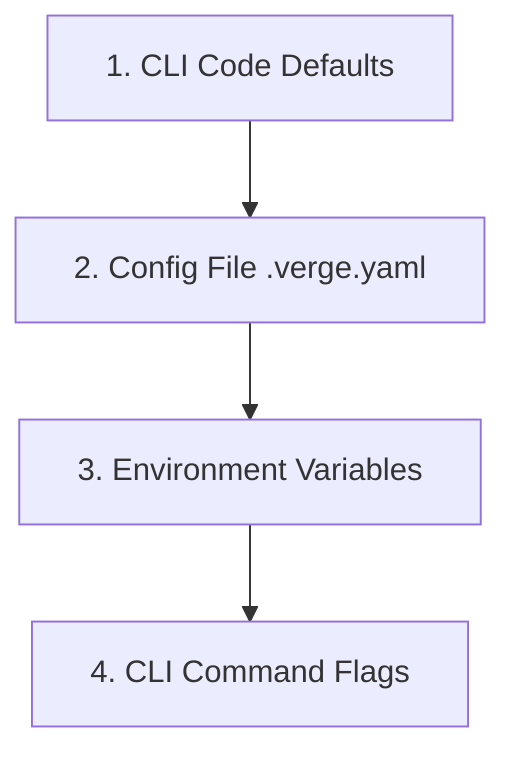

# Configuration Overview

Verge uses a single `.verge.yaml` file as its single source of truth for automatic version calculation. By isolating provider-specific configurations and cascading defaults, the configuration remains clean, modular, and easy to maintain.

---

## The Precedence Cascade

Verge evaluates arguments and configuration parameters in a strict hierarchical order. Subsequent layers overwrite values specified in lower layers:



1. **CLI Defaults:** Built-in default values defined in Verge source code (e.g., defaulting `version_type` to `vsemver` and `provider.type` to `gittag`).
2. **Config File (`.verge.yaml`):** Loaded from the current directory or specified path.
3. **Environment Variables:** Environment overrides (e.g. `VERGE_VERSION_TYPE`, `VERGE_PROVIDER_TYPE`) to dynamically change behavior in specific CI runs without touching code or yaml.
4. **CLI Command Flags:** Active command overrides passed during execution (e.g., `--kind minor` or `--type pep440`).

---

## `.verge.yaml` Schema Structure

A fully-featured `.verge.yaml` includes configuration for the core version parser, default bumping rules, sequence generators, and the single active version tracking provider:

```yaml
# Global version format type (semver | vsemver | pep440)
version_type: vsemver

# Default fallback rules for bumping versions
default:
  bump_kind: prerelease      # (major | minor | patch | prerelease | final)
  prerelease_stage: dev      # (dev | a | b | rc)

# Sequence generation parameters for prerelease tags
sequence:
  type: filehash             # (increment | filehash | passed)
  targets:                   # Files or directories to hash (for filehash)
    - ./Dockerfile
    - ./package.json
  length: 7                  # Truncation length for hash sequence strings

# Version tracking provider (exactly one active block)
provider:
  type: ghcr                 # Active provider (gittag | ghrelease | ghcr)
  ghcr:
    package: owner/repo
```

---

## Environment Variables

* **`VERGE_CONFIG`:** Specifies a custom path to the configuration file (overridden by the CLI flag `-c, --config`).
* **`VERGE_VERSION_TYPE`:** Overrides the global `version_type` value.
* **`VERGE_PROVIDER_TYPE`:** Overrides the active `provider.type` value.
* **`GITHUB_TOKEN`:** Used by `ghrelease` and `ghcr` providers for authorized GitHub API operations.

---

## Next Steps

To dive deeper into specific configurations:
* [Version Types](version_types.md): Learn about the rules and representations for SemVer, VSemVer, and PEP440.
* [Providers](providers.md): Configure how Verge reads and parses tags from git or container registries.
* [Sequence Calculators](sequence.md): Orchestrate dynamic hash sequences and automatic increment logic.
